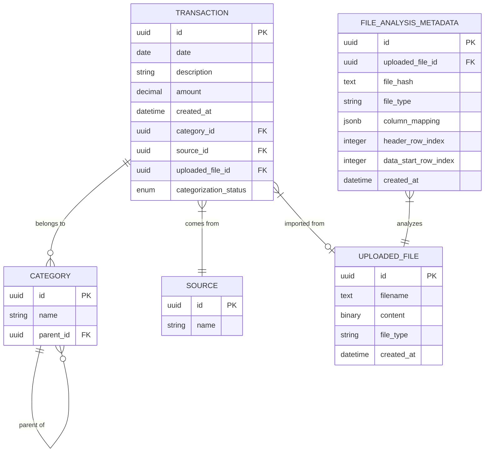

# Data Model

This document describes the entities and attributes used in the Bank Statement Analyzer system, including relationships and business logic assumptions.

## Entity Relationship Diagram

## Entities and Attributes

### Transaction

The Transaction entity represents a financial transaction from a bank statement.

| Attribute | Type | Description | Constraints |
|-----------|------|-------------|------------|
| id | UUID | Unique identifier | Primary Key, Default: uuid4() |
| date | Date | Transaction date | Not Null, Indexed |
| description | String | Transaction description | Not Null |
| amount | Decimal(10,2) | Transaction amount | Not Null |
| created_at | DateTime | Creation timestamp | Not Null, Default: current UTC time |
| uploaded_file_id | UUID | Reference to the uploaded file | Foreign Key to UploadedFile.id, Nullable |
| category_id | UUID | Reference to the category | Foreign Key to Category.id, Nullable |
| source_id | UUID | Reference to the source | Foreign Key to Source.id, Nullable |
| categorization_status | Enum | Status of categorization | Not Null, Default: "UNCATEGORIZED", Values: ["UNCATEGORIZED", "CATEGORIZED", "FAILURE"] |

### Category

The Category entity represents a transaction category with hierarchical structure.

| Attribute | Type | Description | Constraints |
|-----------|------|-------------|------------|
| id | UUID | Unique identifier | Primary Key, Default: uuid4() |
| name | String | Category name | Not Null |
| parent_id | UUID | Reference to parent category | Foreign Key to Category.id, Nullable |

### Source

The Source entity represents a bank or financial institution that provides statements.

| Attribute | Type | Description | Constraints |
|-----------|------|-------------|------------|
| id | UUID | Unique identifier | Primary Key, Default: uuid4() |
| name | String | Source name | Not Null, Unique |

### UploadedFile

The UploadedFile entity stores the raw content of uploaded bank statement files.

| Attribute | Type | Description | Constraints |
|-----------|------|-------------|------------|
| id | UUID | Unique identifier | Primary Key, Default: uuid4() |
| filename | Text | Original filename | Not Null |
| content | LargeBinary | Raw file content | Not Null |
| file_type | String | File type (e.g., "csv", "xlsx") | Not Null |
| created_at | DateTime | Creation timestamp | Not Null, Default: current UTC time |

### FileAnalysisMetadata

The FileAnalysisMetadata entity stores the analysis results for uploaded files, enabling deduplication.

| Attribute | Type | Description | Constraints |
|-----------|------|-------------|------------|
| id | UUID | Unique identifier | Primary Key, Default: uuid4() |
| uploaded_file_id | UUID | Reference to the uploaded file | Foreign Key to UploadedFile.id, Not Null |
| file_hash | Text | Hash of file content for deduplication | Not Null, Unique, Indexed |
| file_type | String | File type (e.g., "csv", "xlsx") | Not Null |
| column_mapping | JSONB | Mapping of file columns to transaction fields | Not Null |
| header_row_index | Integer | Index of the header row | Not Null |
| data_start_row_index | Integer | Index where data rows begin | Not Null |
| created_at | DateTime | Creation timestamp | Not Null, Default: current UTC time |

## Relationships

1. **Transaction to Category (Many-to-One)**
   - A transaction can belong to one category
   - A category can have many transactions
   - The relationship is optional (transactions can be uncategorized)

2. **Transaction to Source (Many-to-One)**
   - A transaction comes from one source
   - A source can have many transactions
   - The relationship is optional (transactions can exist without a source)

3. **Transaction to UploadedFile (Many-to-One)**
   - A transaction can be imported from one file
   - A file can contain many transactions
   - The relationship is optional (transactions can be created manually)

4. **Category to Category (Self-referential, Many-to-One)**
   - A category can have one parent category
   - A category can have many child categories
   - The relationship is optional (root categories have no parent)

5. **FileAnalysisMetadata to UploadedFile (One-to-One)**
   - A file analysis metadata entry analyzes one uploaded file
   - An uploaded file has one file analysis metadata entry
   - The relationship is mandatory for FileAnalysisMetadata

## Business Logic Assumptions

1. **Transaction Amounts**
   - Positive amounts represent money coming in (credits)
   - Negative amounts represent money going out (debits)

2. **Categorization**
   - Transactions start with "UNCATEGORIZED" status
   - Once categorized, they move to "CATEGORIZED" status
   - If categorization fails, they move to "FAILURE" status
   - Transactions can be manually categorized or batch processed

3. **Category Hierarchy**
   - Categories form a tree structure with parent-child relationships
   - A category can have multiple subcategories but only one parent
   - Root categories have no parent (parent_id is null)
   - Circular references are not allowed (a category cannot be its own ancestor)

4. **File Deduplication**
   - Files are hashed to detect duplicates
   - If a file with the same hash exists, it's considered a duplicate
   - Duplicate files are not processed again to avoid duplicate transactions

5. **File Processing**
   - Files are analyzed to detect column mappings
   - Column mappings map file columns to transaction fields
   - Header row and data start row are detected during analysis
   - Transactions are normalized before being saved to the database

6. **Sources**
   - Sources represent banks or financial institutions
   - Source names must be unique
   - Sources are selected during file upload
   - Transactions are associated with their source for better organization
