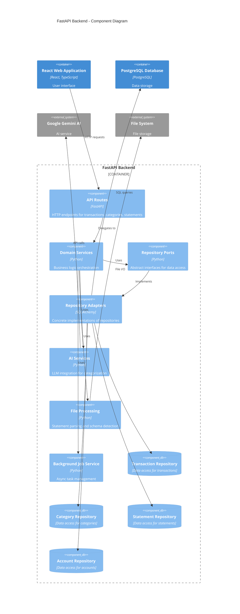

# C4 Component Diagram - Backend Services

This diagram shows the internal structure of the FastAPI Backend container following hexagonal architecture principles.

```mermaid
C4Component
    title FastAPI Backend - Component Diagram

    Container(webApp, "React Web Application", "React, TypeScript", "User interface")
    Container(database, "PostgreSQL Database", "PostgreSQL", "Data storage")
    System_Ext(geminiAI, "Google Gemini AI", "AI service")
    System_Ext(fileSystem, "File System", "File storage")
    
    Container_Boundary(api, "FastAPI Backend") {
        Component(apiRoutes, "API Routes", "FastAPI", "HTTP endpoints for transactions, categories, statements")
        Component(services, "Domain Services", "Python", "Business logic orchestration")
        Component(ports, "Repository Ports", "Python", "Abstract interfaces for data access")
        Component(adapters, "Repository Adapters", "SQLAlchemy", "Concrete implementations of repositories")
        Component(aiService, "AI Services", "Python", "LLM integration for categorization")
        Component(fileProcessing, "File Processing", "Python", "Statement parsing and schema detection")
        Component(backgroundService, "Background Job Service", "Python", "Async task management")
        
        ComponentDb(transactionRepo, "Transaction Repository", "Data access for transactions")
        ComponentDb(categoryRepo, "Category Repository", "Data access for categories") 
        ComponentDb(statementRepo, "Statement Repository", "Data access for statements")
        ComponentDb(accountRepo, "Account Repository", "Data access for accounts")
    }
    
    Rel(webApp, apiRoutes, "HTTP requests")
    Rel(apiRoutes, services, "Delegates to")
    Rel(services, ports, "Uses")
    Rel(ports, adapters, "Implements")
    Rel(adapters, database, "SQL queries")
    
    Rel(services, aiService, "Uses")
    Rel(services, fileProcessing, "Uses")
    Rel(services, backgroundService, "Uses")
    
    Rel(aiService, geminiAI, "API calls")
    Rel(fileProcessing, fileSystem, "File I/O")
    
    Rel(adapters, transactionRepo, "")
    Rel(adapters, categoryRepo, "")
    Rel(adapters, statementRepo, "")
    Rel(adapters, accountRepo, "")
    
    UpdateRelStyle(webApp, apiRoutes, $offsetY="-10")
    UpdateRelStyle(apiRoutes, services, $offsetY="-10")
    UpdateRelStyle(services, ports, $offsetY="-10")
    UpdateRelStyle(ports, adapters, $offsetY="-10")
```