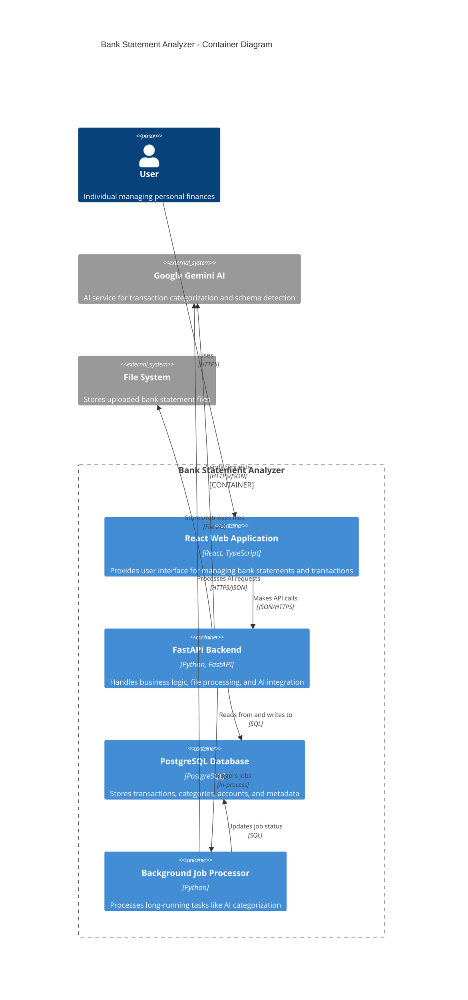

# C4 Container Diagram - Bank Statement Analyzer

This diagram shows the major application components and their interactions.

```mermaid
C4Container
    title Bank Statement Analyzer - Container Diagram

    Person(user, "User", "Individual managing personal finances")
    
    Container_Boundary(c1, "Bank Statement Analyzer") {
        Container(webApp, "React Web Application", "React, TypeScript", "Provides user interface for managing bank statements and transactions")
        Container(api, "FastAPI Backend", "Python, FastAPI", "Handles business logic, file processing, and AI integration")
        Container(database, "PostgreSQL Database", "PostgreSQL", "Stores transactions, categories, accounts, and metadata")
        Container(backgroundJobs, "Background Job Processor", "Python", "Processes long-running tasks like AI categorization")
    }
    
    System_Ext(geminiAI, "Google Gemini AI", "AI service for transaction categorization and schema detection")
    System_Ext(fileSystem, "File System", "Stores uploaded bank statement files")
    
    Rel(user, webApp, "Uses", "HTTPS")
    Rel(webApp, api, "Makes API calls", "JSON/HTTPS")
    Rel(api, database, "Reads from and writes to", "SQL")
    Rel(api, backgroundJobs, "Triggers jobs", "In-process")
    Rel(api, geminiAI, "Sends requests", "HTTPS/JSON")
    Rel(api, fileSystem, "Stores/retrieves files", "File I/O")
    Rel(backgroundJobs, database, "Updates job status", "SQL")
    Rel(backgroundJobs, geminiAI, "Processes AI requests", "HTTPS/JSON")
    
    UpdateRelStyle(user, webApp, $offsetY="-10")
    UpdateRelStyle(webApp, api, $offsetY="-10")
    UpdateRelStyle(api, database, $offsetX="-30")
    UpdateRelStyle(api, backgroundJobs, $offsetY="10")
```