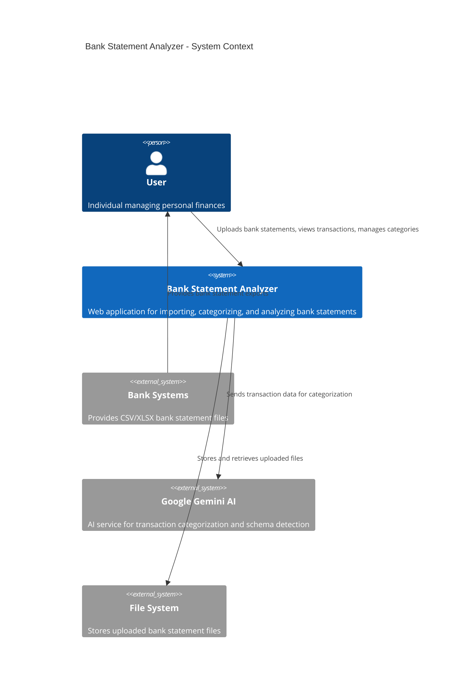

# C4 Context Diagram - Bank Statement Analyzer

This diagram shows the system boundaries and external actors that interact with the Bank Statement Analyzer.

```mermaid
C4Context
    title Bank Statement Analyzer - System Context

    Person(user, "User", "Individual managing personal finances")
    System(bankStatementAnalyzer, "Bank Statement Analyzer", "Web application for importing, categorizing, and analyzing bank statements")
    
    System_Ext(bankSystem, "Bank Systems", "Provides CSV/XLSX bank statement files")
    System_Ext(geminiAI, "Google Gemini AI", "AI service for transaction categorization and schema detection")
    System_Ext(fileSystem, "File System", "Stores uploaded bank statement files")
    
    Rel(user, bankStatementAnalyzer, "Uploads bank statements, views transactions, manages categories")
    Rel(bankStatementAnalyzer, geminiAI, "Sends transaction data for categorization")
    Rel(bankStatementAnalyzer, fileSystem, "Stores and retrieves uploaded files")
    Rel(bankSystem, user, "Provides bank statement exports")
    
    UpdateRelStyle(user, bankStatementAnalyzer, $offsetY="-20")
    UpdateRelStyle(bankStatementAnalyzer, geminiAI, $offsetY="-10")
    UpdateRelStyle(bankStatementAnalyzer, fileSystem, $offsetY="10")
```