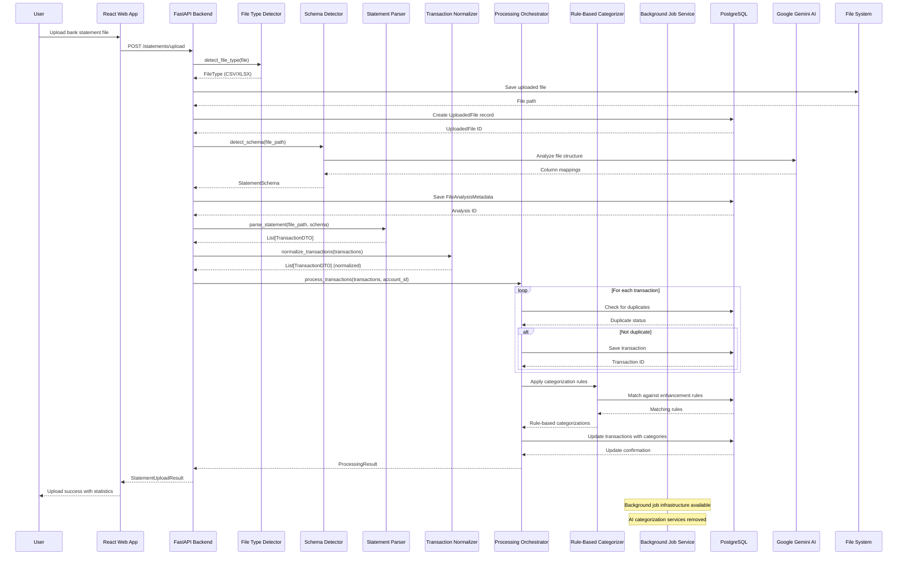

# Sequence Diagram - Statement Processing Flow

This diagram shows the complete flow of processing a bank statement from upload to transaction import. AI categorization and counterparty services have been removed, but background job infrastructure remains available.

