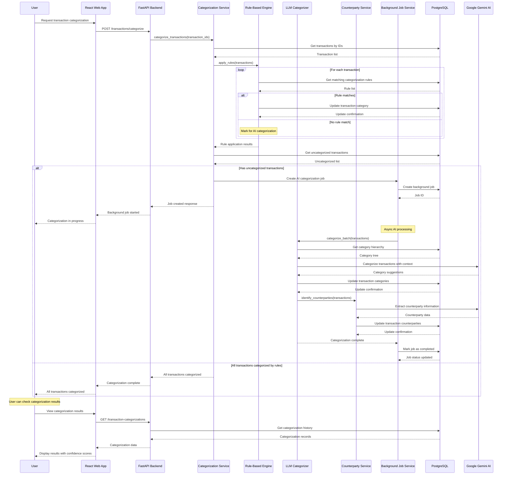

# Sequence Diagram - Transaction Categorization Flow

This diagram shows the process of categorizing transactions using both rule-based and AI-powered methods.

```mermaid
sequenceDiagram
    participant User
    participant WebApp as React Web App
    participant API as FastAPI Backend
    participant CategorizationService as Categorization Service
    participant RuleEngine as Rule-Based Engine
    participant LLMCategorizer as LLM Categorizer
    participant CounterpartyService as Counterparty Service
    participant BackgroundJobs as Background Job Service
    participant Database as PostgreSQL
    participant GeminiAI as Google Gemini AI
    
    User->>WebApp: Request transaction categorization
    WebApp->>API: POST /transactions/categorize
    
    API->>CategorizationService: categorize_transactions(transaction_ids)
    
    CategorizationService->>Database: Get transactions by IDs
    Database-->>CategorizationService: Transaction list
    
    CategorizationService->>RuleEngine: apply_rules(transactions)
    
    loop For each transaction
        RuleEngine->>Database: Get matching categorization rules
        Database-->>RuleEngine: Rule list
        
        alt Rule matches
            RuleEngine->>Database: Update transaction category
            Database-->>RuleEngine: Update confirmation
        else No rule match
            Note over RuleEngine: Mark for AI categorization
        end
    end
    
    RuleEngine-->>CategorizationService: Rule application results
    
    CategorizationService->>Database: Get uncategorized transactions
    Database-->>CategorizationService: Uncategorized list
    
    alt Has uncategorized transactions
        CategorizationService->>BackgroundJobs: Create AI categorization job
        BackgroundJobs->>Database: Create background job
        Database-->>BackgroundJobs: Job ID
        
        CategorizationService-->>API: Job created response
        API-->>WebApp: Background job started
        WebApp-->>User: Categorization in progress
        
        Note over BackgroundJobs: Async AI processing
        BackgroundJobs->>LLMCategorizer: categorize_batch(transactions)
        
        LLMCategorizer->>Database: Get category hierarchy
        Database-->>LLMCategorizer: Category tree
        
        LLMCategorizer->>GeminiAI: Categorize transactions with context
        GeminiAI-->>LLMCategorizer: Category suggestions
        
        LLMCategorizer->>Database: Update transaction categories
        Database-->>LLMCategorizer: Update confirmation
        
        LLMCategorizer->>CounterpartyService: identify_counterparties(transactions)
        CounterpartyService->>GeminiAI: Extract counterparty information
        GeminiAI-->>CounterpartyService: Counterparty data
        
        CounterpartyService->>Database: Update transaction counterparties
        Database-->>CounterpartyService: Update confirmation
        
        LLMCategorizer-->>BackgroundJobs: Categorization complete
        BackgroundJobs->>Database: Mark job as completed
        Database-->>BackgroundJobs: Job status updated
        
    else All transactions categorized by rules
        CategorizationService-->>API: All transactions categorized
        API-->>WebApp: Categorization complete
        WebApp-->>User: All transactions categorized
    end
    
    Note over User: User can check categorization results
    User->>WebApp: View categorization results
    WebApp->>API: GET /transaction-categorizations
    API->>Database: Get categorization history
    Database-->>API: Categorization records
    API-->>WebApp: Categorization data
    WebApp-->>User: Display results with confidence scores
```
