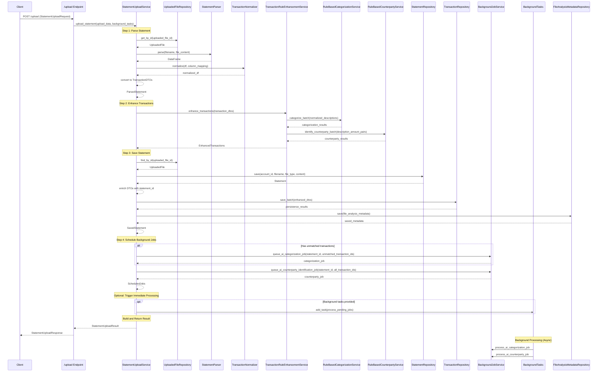

# Upload Endpoint Sequence Diagram

This document contains a Mermaid sequence diagram showing the complete flow of the `/upload` endpoint in the Bank Statement Analyzer API.

## Sequence Diagram

## Flow Description

### Simplified 4-Step Process

1. **Parse Statement** - Convert uploaded file to structured transaction DTOs
2. **Enhance Transactions** - Apply rule-based categorization and counterparty identification  
3. **Save Statement** - Persist transactions to database with deduplication and metadata
4. **Schedule Background Jobs** - Queue AI processing for unmatched transactions

### Key Components

- **StatementUploadService**: Main orchestrator using clean 4-step process
- **TransactionRuleEnhancementService**: Pure enhancement service (no side effects)
- **StatementRepository & TransactionRepository**: Handle database persistence
- **BackgroundJobService**: Manages asynchronous AI processing
- **RuleBasedCategorizationService**: Applies categorization rules
- **RuleBasedCounterpartyService**: Identifies transaction counterparties

### Architectural Improvements

**Separation of Concerns:**
- **Enhancement** is now pure (no database operations)
- **Persistence** is handled directly by repositories (no intermediate service layer)
- **Job scheduling** is isolated as its own step

**Benefits:**
- Easier to test each step independently
- Clear responsibility boundaries
- Better error handling per step
- More maintainable and readable code

### Background Processing

The system queues two types of background jobs:
- **AI Categorization**: For transactions not matched by rules
- **AI Counterparty Identification**: For all transactions to enhance counterparty data

Background jobs can run immediately via FastAPI BackgroundTasks or be processed later by cron jobs.